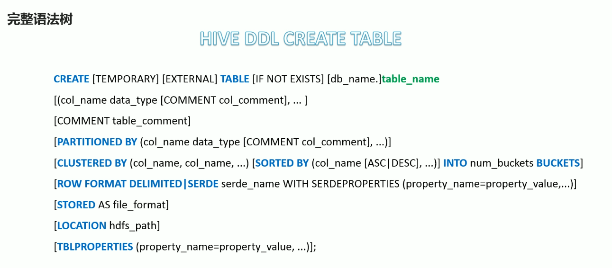
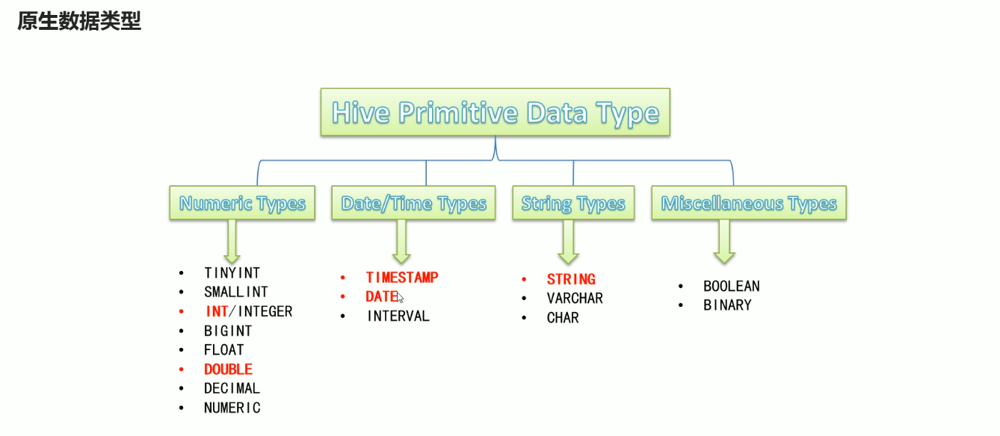
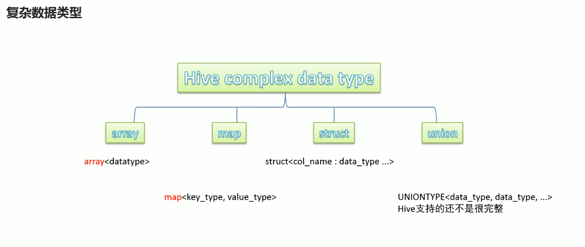

> 黑马：https://www.bilibili.com/video/BV1L5411u7ae?p=33

##  DDL概述

+ 数据库定义语言（Data Definition Language，DDL）是 SQL 语言集中对数据库内部的 **对象结构进行创建、删除、修改等操作语言**，这些数据库对象包括 database（schema）、table、view、index 等
+ DDL 核心语法由 **CREATE、ALTER和DROP** 三个组成。DDL 并不涉及内部数据的操作。
+ 在某些上下文中，该术语也被成为数据描述语言，因此它描述了数据库表中的字段和记录

### Hive DDL 语法

+ Hive 与标准 SQL 的语法大同小异，基本相通，注意差异即可
+ 基于 Hive 的设计，使用特点，**HQL 中 create 语法（尤其是 create table）将是学习掌握 Hive DDL 的重中之重**。建表是否成功直接影响文件是否映射成功，进而影响后续是否可以基于SQL分析数据。通俗点说，没有表，表没有数据，拿什么分析。

注意事项：

1. **蓝色字体** 是建表语句的关键字，用于指定某些功能
2. **[ ]** 中括号的语法表示可选
3. **|** 表示使用的时候，左右语法二选一
4. **建表语句重的语法顺序要和语法树中的顺序保持一致**

[hive的使用示例详解-建表、数据类型详解、内部外部表、分区表、分桶表](https://blog.csdn.net/chenwewi520feng/article/details/131047246)

[官方数据类型](https://cwiki.apache.org/confluence/display/Hive/LanguageManual+DDL)

## 数据类型

### 1、整体类型

Hive中的数据类型指的是Hive表中的列字段类型。
Hive数据类型整体分为两个类别：原生数据类型（primitive data type）和复杂数据类型（complex data type）。
原生数据类型包括：数值类型、时间类型、字符串类型、杂项数据类型；
复杂数据类型包括：array数组、map映射、struct结构、union联合体。

注意事项：

- 英文字母大小写不敏感
- 除SQL数据类型外，还支持Java数据类型，比如：string
- int和string是使用最多的，大多数函数都支持
- 复杂数据类型的使用通常需要和分隔符指定语法配合使用
- 如果定义的数据类型和文件不一致，hive会尝试隐式转换，但是不保证成功

### 2、原生数据类型

### 3、复杂数据类型

### 4、隐藏转换、显示转换

[官方转换图](https://cwiki.apache.org/confluence/display/Hive/LanguageManual+Types)