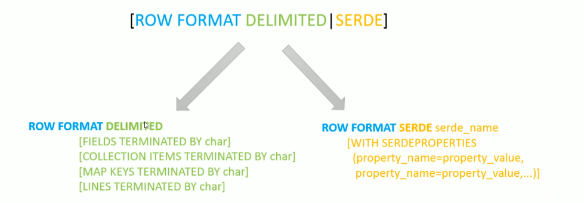
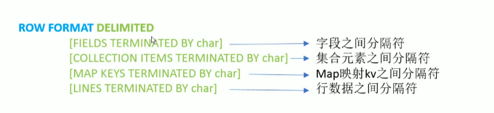

## SerDe 概述

SerDe 是 Serializer、Deserializer 的简称，目的是用于序列化和反序列化

序列化是对象转换为字节码的过程，而反序列化是字节码转换为对象的过程

Hive 使用 SerDe 包括 FileFormat 读取和写入表行对象，需要注意的是，"key" 部分在读取会被忽略，而在写时，key始终是常量，基本上行对象存储在 value 中。

```
READ:
HDFS Files > InputFileFormat > key,value > Deserializer > Row Object

Write:
Row Object >  key,value > Serializer > OutPutFileFormat > HDFS Files
```

### 1、Hive 读写文件机制

1. Hive 读取文件首先调用 InputFormat (默认 TextInputFormat) 返回一条一条 k，v 键值对记录，（默认一行对应一条键值对）。然后调用 SerDe（默认 LazySimpleSerDe）的 Deserializer ，将一条记录中的 value 根据分隔符切分成各个字段
2. Hive 写文件机制，将 Row 写入文件时，首先调用 SerDe（默认 LazySimpleSerDe）的 Serializer 将对象转换成字节序列，然后调用 OutputFormat 将数据写入 HDFS 中


## SerDe 相关语法

+ 其中` ROW FORMAT` 是语法关键字， `DELIMITED `和 `SERDE `二选一
+ 如果使用 delimited 表示使用默认的 LazySimpleSerDe 类处理数据
+ 如果数据文件格式比较特殊，使用 ROW FORMAT SERDE serde_name 指定其他 SerDe 类来处理数据，甚至支持用户自定义 SerDe 类。




### 1、LazySimpleSerDe 分隔符指定

+ LazySimpleSerDe 是 Hive 默认的序列化类，包含 4 种子语法，分别用于字段之间、集合元素之间，map 映射 kv 之间，换行符和分隔符。
+ 在建表的时候可以根据数据的特点灵活使用



#### 1.1、默认分隔符

hive建表时如果没有row format语法。此时字段之间默认的分割符是 `\001`，是一种特殊的字符，使用的是ascii编码的值。


## 存储路径

Hive表默认存储路径是由`${HIVE_HOME}/conf/hive-site.xml`配置文件的 `hive.metastore.warehouse.dir` 属性指定。

默认值是：`/user/hive/warehouse`。


### 1、指定存储路径

语法：[LOCATION  hdfs_location]

建议单独使用表的时候，采用 Location 这种办法，如果是统一管理，修改 hive-site 配置文件

