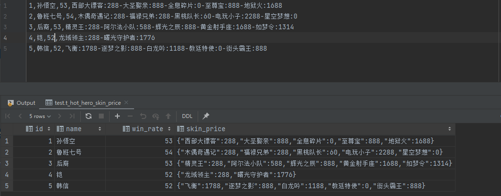

### 分隔符

#### 指定分隔符 "/t"
语法：
```
create table t_archer(...)
row format delimited fields terminated by "\t";
```

采用 "\t" 进行分割


#### 指定分隔符","

##### 特殊数据类型



```
create table t_hot_hero_skin_price(
    id int,
    name string,
    win_rate int,
    skin_price map<string,int>
)
row format delimited
fields terminated by ','
collection items terminated by '-'
map keys terminated by ':' ;
```


#### 默认分隔符

字段以 `\001` 分割建表，非常方便。（优先考虑此分隔符）


