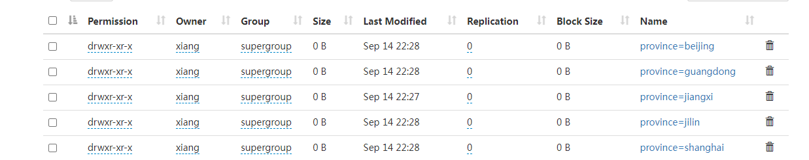
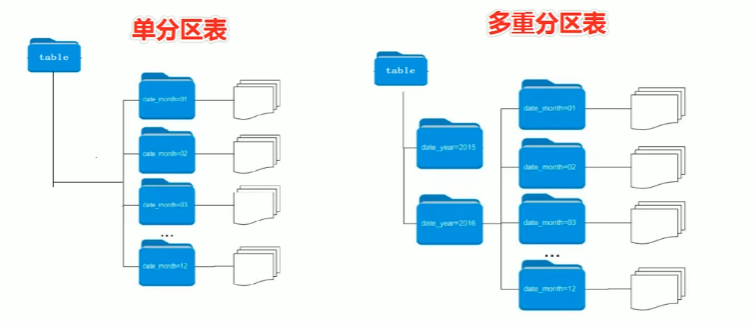

## Partitioned 分区表

关键字 PARITIONED BY

```sql
-- 分区表建表语句
create table table_name(
	column1 data_type,
    column2 data_type
...)
PARTITIONED BY (partition1 data_type,partition2 data_type,...)
```

注意 分区字段不能是表中已经存在的字段，因为分区字段最终会以虚拟字段形式显示出来。

分区表文件是不能直接通过 `hdfs dfs -put` 放入的。


### 静态分区

语法如下

```
load data [local] inpath 'filepath' into table table_name partition(分区字段 = '分区值',...)
```

如果文件在 Linux 系统上，需要加上 `local `关键字

如果是在 HDFS 系统里，就不需要加 `local`


```shell
load data local inpath '/home/xiang/txt/partition/jiangxi.txt' into table t_china_region_partition_tmp partition (province='jiangxi');
load data local inpath '/home/xiang/txt/partition/beijing.txt' into table t_china_region_partition_tmp partition(province='beijing');
load data local inpath '/home/xiang/txt/partition/jilin.txt' into table t_china_region_partition_tmp partition(province='jilin');
load data local inpath '/home/xiang/txt/partition/guangdong.txt' into table t_china_region_partition_tmp partition(province='guangdong');
load data local inpath '/home/xiang/txt/partition/shanghai.txt' into table t_china_region_partition_tmp partition(province='shanghai');
```




### 多层分区



```sql
-- 单分区，按省份分区
create table t_china_region_province(
   ...
) partitioned by (province string)
    row format delimited fields terminated by ",";

-- 二分区，按省份、市区分区
create table t_china_region_city(
   ...
) partitioned by (province string,city String)
    row format delimited fields terminated by ",";

-- 三分区，按省份、市区,区县分区
create table t_china_region_district(
   ...
) partitioned by (province string,city String,district String)
    row format delimited fields terminated by ",";
```

分区字段之间是一种递进关系，因此要注意分区字段的顺序，谁先谁后。

加载双分区数据

```sql
-- 双分区的数据加载，静态分区加载数据
load data local inpath '/home/xiang/txt/partition/guangdong-shenzhen.txt'
    into table t_china_region_city partition (province='guangdong',city='shenzhen');

load data local inpath '/home/xiang/txt/partition/guangdong-guangzhou.txt'
    into table t_china_region_city partition (province='guangdong',city='guangzhou');
```


### 动态分区

所谓动态分区就是指，字段值基于查询结果（参数位置）自动推断来的，核心语法就是 **insert + select**

启用 hive 动态分区，需要在 hive 会话中设置两个参数

```sql
-- 是否开启动态分区功能
set hive.exec.dynamic.partition=true;

-- 指定动态分区模式，分为 nonstick 非严格模式和 strict 严格模式
-- strict 严格模式要求至少一个分区为静态分区
set hive.exec.dynamic.partition.mode=nonstick
```


==当分区为中文时，大概率会出现一些问题==

这里给一些解决方案，但是不一定能解决

[https://blog.csdn.net/weixin_42123844/article/details/121080353](https://blog.csdn.net/weixin_42123844/article/details/121080353)


### 注意事项

1. 分区表不是建表的必要语法规则，是一种优化手段，可选；
2. 分区字段不能是表中已有字段，不能重复
3. 分区字段是虚拟字段，其数据并不存储在底层文件中
4. 分区字段值的确来自用户价值数据手动指定（静态分区），或者根据查询结果自动推断（动态分区）
5. Hive 支持多重分区，也就是说在分区的基础上继续分区，划分更细粒度。