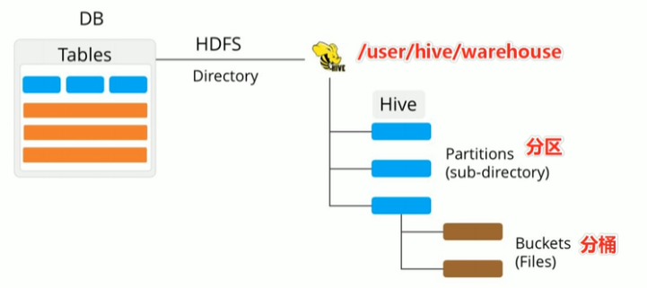

## 分桶表

+ 分桶表也叫桶表，是一种优化查询而设计的表类型



和分区不一样，分桶是将文件拆分为若个个独立的小文件。

分桶规则如下：桶编号相同的数据会被分到同一个桶中去

```
Bucket number = hash_function(bucketing_column) mod num_buckets
分桶编号		= 哈希方法（分桶字段）				取模	分桶个数
```

`hash_function`哈希方法取决于分桶字段 `bucketing_column `的类型，如果是 int 类型，哈希方法就是本身；但如果是 bigint、string复杂类型，哈希方法就会特殊处理。	


### 优点

#### 1、减少全表扫描

假设表是根据 status 字段分桶的，查询条件如果包含 status 字段，则会只扫描到指定分桶。


#### 2、JOIN查询提高MR效率，减少笛卡儿积数量

根据 Join 字段设置分桶


#### 3、提高抽样查询效率

从每个桶中抽取部分数据，比较科学。