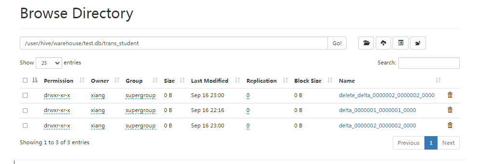

## Hive事务

### 简介

早期 Hive 是不支持事务的，因为 Hive的核心目标是 离线数据分析，是面向分析的工具，而且映射文件是在 HDFS 上的，HDFS 不支持随机修改。

但是 Hive 从0.14 版本之后，具有 ACID 语义的事务已经添加到 Hive 中


### 事务局限性

1. 尚不支持 BEGIN、COMMIT、ROLLBACK。所有语言操作都是自动提交
2. 仅支持ORC文件格式
3. 默认情况下事务配置关闭，需要配置参数开启使用
4. 表必须是分桶表才可以使用事务功能
5. 表参数 transactional 必须为 true
6. 外部表不能成为 ACID 表，不允许从非 ACID 会话读取、写入 ACID 表。


```sql
--1、开启事务配置（可以使用set设置当前session生效 也可以配置在hive-site.xml中）
set hive.support.concurrency = true; --Hive是否支持并发
set hive.enforce.bucketing = true; --从Hive2.0开始不再需要  是否开启分桶功能
set hive.exec.dynamic.partition.mode = nonstrict; --动态分区模式  非严格
set hive.txn.manager = org.apache.hadoop.hive.ql.lockmgr.DbTxnManager; --
set hive.compactor.initiator.on = true; --是否在Metastore实例上运行启动压缩合并
set hive.compactor.worker.threads = 1; --在此metastore实例上运行多少个压缩程序工作线程。
```


```sql
-- 创建事务表
-- 只有在当前会话开启了 事务配置的时候，才可以创建
create table trans_student(
    id int,
    name String,
    age int
)clustered by (id) into 2 buckets
stored as orc TBLPROPERTIES ('transactional'='true');


insert into trans_student(id, name, age) values (1, 'xiaoxiao', 20);
select * from trans_student;
-- 支持事务
update trans_student set age = 18 where id = 1;
```

 底层操作



