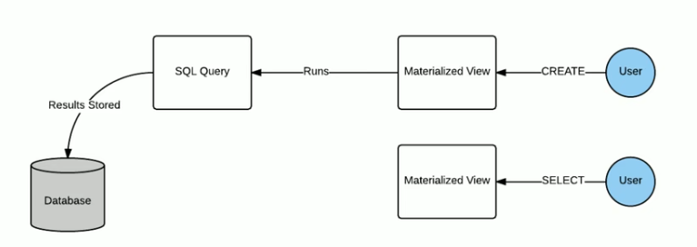

# 视图

## 概念

1. Hive 中的视图（View） 是一种虚拟表，只保存定义，不实际存储数据。
2. 通常从真实的物理表查询中创建生成视图，也可以从已经存在的视图上创建新视图。
3. 创建视图时，将冻结视图的架构，如果删除或更改基础表，则视图将失败。
4. 视图是用来简化操作的，不缓冲记录，也没有提高性能。


可以基于表创建视图

也可以基于视图二次创建视图

可以通过视图来限制数据访问的权限。

1. 限制字段
2. 限制条件

使用视图查询优化查询语句，本质上是不能简化查询效率的，但是可以减少sql的书写。


## 物化视图

物化视图是严格**包括查询结果**的数据库对象，可以用于 预先计算保存 表连接或聚集等耗时较多的操作结果。

使用物化视图的目的是**通过预算，提高查询效率，当然要占用一定空间**



作为 Hive3.0 新特性，物化视图

#### 物化视图概念

1. Hive3.0 开始尝试引入物化视图，并提供对于物化**视图的查询自动重写机制**（基于 Apache Calcite实现）
2. Hive 的物化视图还提供了 **物化视图存储选择机制**，可以本地存储在 Hive，也可以通过用户自定义 storeage handlers 存储在其他系统比如 Druid
3. Hive 引入物化视图的目的就是为了 **优化查询访问的效率，相当于从数据预处理的角度优化数据访问**
4. Hive 从 3.0 丢弃了 index 索引的语法支持，推荐使用物化视图和列示存储文件格式来加快查询速度

#### 物化视图和视图的区别

1. 视图的虚拟的。
   1. 简化查询。
2. 物化视图是真实的。
   1. 提前保存结果，提高查询性能。


#### 物化视图语法

```sql
CREATE MATERIALIZED VIEW ....
as SELECT ...
```

==如果select 结果发送变更，物化视图能否对应变更？ 目前Hive只提供了手动出发变更！==


#### 基于物化视图的查询重写

1. 物化视图创建后，可用于相关的查询加速，即，用户提交查询 query，若该 query 经过重写后可以命中已经存在的物化视图，则直接通过物化视图查询结果反数据，以实现查询加速

2. 是否重写查询使用物化视图可以通过全局参数控制，默认为 true，`hive.materializedview.rewirting=true`

3. 用户可选择的控制物化视图的查询重新机制，

   ```
   ALTER MATERIALIZED VIEW [db_name.] materialzied_view_name ENABLE|DISABLE REWRITE;
   ```

   