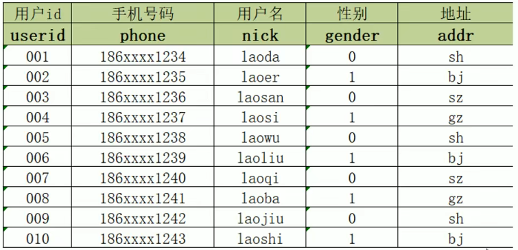
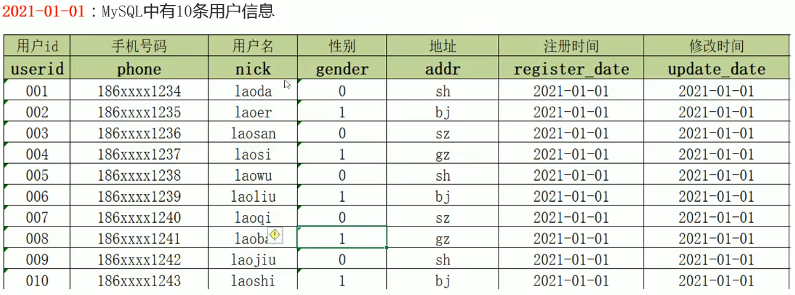
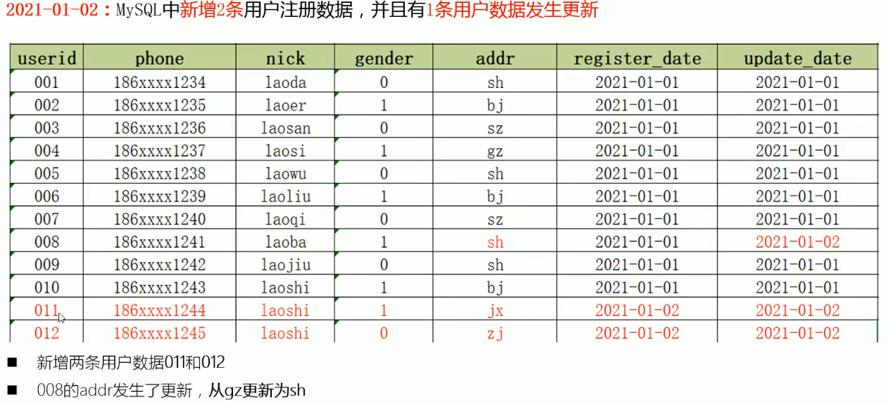
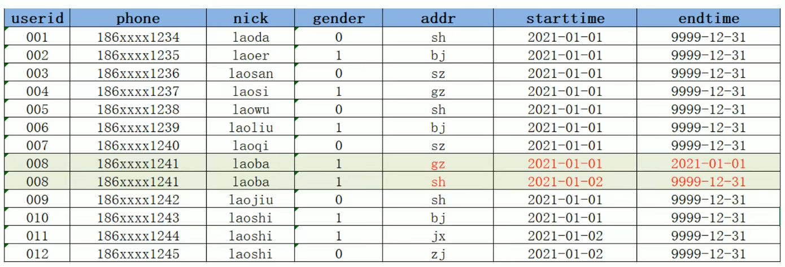
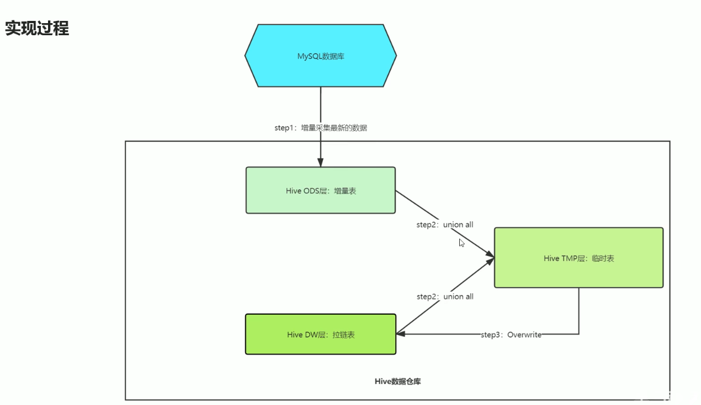
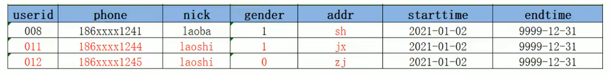

# 拉链表功能场景

​	Hive在实际工作中主要用于构建离线数据仓库，定期的从各种数据源中同步采集数据到Hive中，经过分层转换提供数据应用。例如每天需要从RMDB中同步最新的订单信息、用户信息、店铺信息等到数据仓库中，进行订单分析、用户分析。如果同步后的数据发送了变化，一般的解决办法如下。

## 问题背景

#### 用户表同步数据

+ 假设有一张用户表，每个用户注册完后，就会在用户表新增用户信息，记录该用户id，手机号码，用户名，性别，地址等信息
+ 每天都会有用户注册，产生新的用户信息
+ 每天都需要将表中的用户同步到 Hive 数仓中
+ 需要对用户的信息做统计分析...

#### 已经同步过的数据发生变更

+ 2021-01-01 10条数据

+ **2021-01-02 新增2条，并且有1条进行修改**

> 所以，新增的数据会直接加载到 Hive 表中，但是更新的数据如何存储在 Hive 中呢
>
> ​	1、新增的数据
>
> ​	2、更新的数据咋处理

#### 解决方案

##### 方案1、直接更新

全量更新，先删后插，最方便，但是数据量越大，效率越低，并且没有历史状态

##### 方案2、每天全量快照，每天一张表

解决了历史状态问题，但数据冗余

##### 方案3、构建拉链表

通过时间标记发生变化的数据的每种状态时间周期

## 功能与应用场景

+ 拉链表专门用于解决在数据仓库中，数据如何变化如何实现数据存储问题
+ 拉链表是将更新的数据进行记录，没有发生变更的数据不进行状态存储，用于存储所有数据在不同时间上的所有状态，通过时间进行标记每个状态的生命周期，查询时，根据需求可以获取指定时间范围状态数据，默认用 9999-12-31 等最大值来表示最新状态

#### 步骤1、将有修改的数据字段进行保存

#### 步骤2、拉链表与临时表数据合并，结果写入临时表

#### 步骤3、临时表覆盖拉链表

